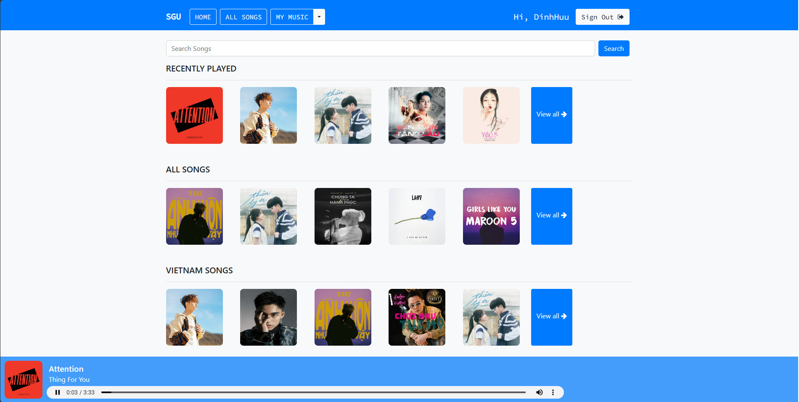

# Django based music streaming website


### Giao diện Website 
#### Home Page



## Cài đặt 📦

>pip install -r requirements.txt

#### Run server locally

```shell
$ python manage.py runserver
```
> Go to localhost:8000

---

## Chức năng 📋
⚡️ Tùy chọn Đăng ký và Đăng nhập.

⚡️ Phát bài hát, xem thông tin chi tiết của bài hát.

⚡️ Tìm kiếm bài hát.

⚡️ Lọc bài hát theo ngôn ngữ và ca sĩ.

⚡️ Tạo danh sách phát mới.

⚡️ Thêm/Xóa bài hát vào/khỏi danh sách phát.

⚡️ Thêm/Xóa bài hát vào/khỏi mục yêu thích.

⚡️ Xem lại các bài hát đã phát/đã xem gần đây.

⚡️ Khám phá các bài hát thông qua danh sách bài hát được cá nhân hóa và mục yêu thích.

---

## Thành viên nhóm ✨

- Thái Đình Hữu 3120410227
- Dương Minh Khánh 3120410241
- Lê Tuấn Hưng 3120410221


